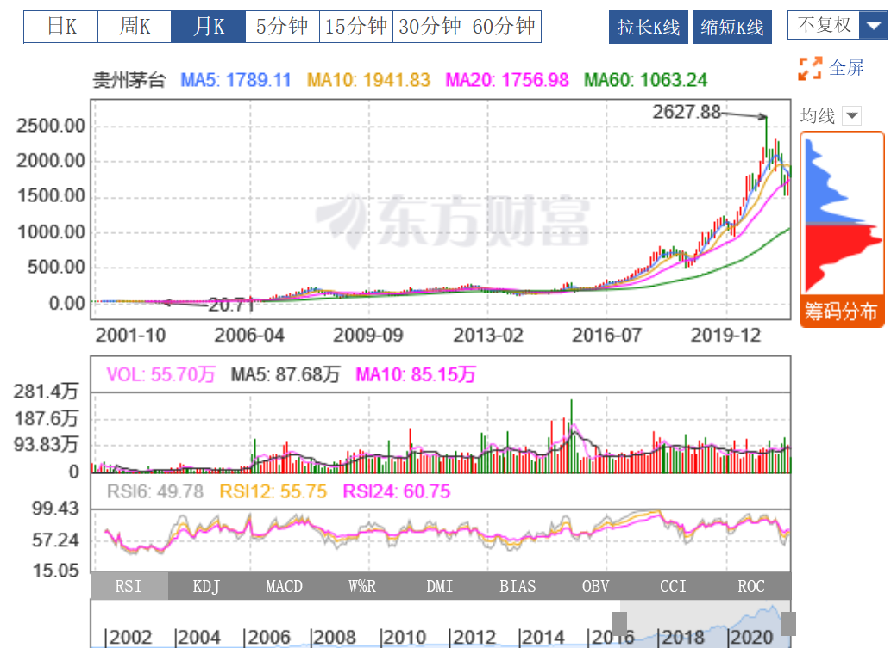

# customize-financial-plotly-plot
>tutorials on further beautifying and adding more functionalities into the plotly plot created in the last tutorial for my wife

In this tutorial, we will continue to dive into the world of `plotly`, a powerful toolkit that enables us to produce vivid 
interactive Python plot.

First, let's recall what we have achieved in the last tutorial.

I have created a repository named [`sample_plot`](https://qj4chen.github.io/sample_plot/), and by click the link you may
be automatically redirected to the site. You may have noticed the plot is quite rough, since it could only exhibit a basic 
daily k-lines plot. What if we want to plot the k-lines of 5-days or 1-month and switch among those plots interactively 
by clicking some buttons as shown in the picture below.

The first step we need to conduct is to generate resampled data for the plot purpose. For resampling, we introduce the 
`resample` function from `pandas` package. For the full documentation of this function, please refer to this [`link`](https://pandas.pydata.org/pandas-docs/stable/reference/api/pandas.DataFrame.resample.html)

