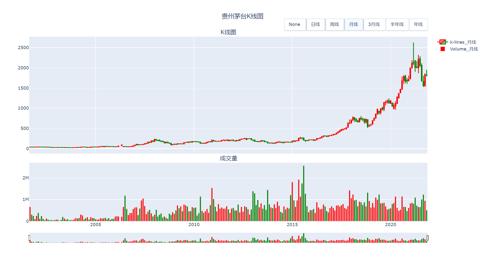

# customize-financial-plotly-plot
>tutorials on further beautifying and adding more functionalities into the plotly plot created in the last tutorial for my wife

In this tutorial, we will continue to dive into the world of `plotly`, a powerful toolkit that enables us to produce vivid 
interactive Python plot.

First, let's recall what we have achieved in the last tutorial.

I have created a repository named [`sample_plot`](https://qj4chen.github.io/sample_plot/) hosting a basic daily k-line plot, 
and by clicking the link you may be automatically redirected to the site. You may have noticed the plot is quite rough, 
since it could only exhibit a basic daily k-lines plot and the `x range bar` is too tall for a secondary/controlling part of a plot. 
What if we want to plot the k-lines of 5-days or 1-month and switch among those plots interactively by clicking some buttons 
as shown in the picture below. And we may also want to make the plot even more elegant to 


And Below is the final plot we would have by the end of this tutorial, if you are lucky.


The first step we need to conduct is to generate resampled data for the plot purpose. For resampling, we introduce the 
`resample` function from `pandas` package. For the full documentation of this function, please refer to this 
[`link`](https://pandas.pydata.org/pandas-docs/stable/reference/api/pandas.DataFrame.resample.html).

# Add buttons to the plot
## resample the data
A common practice for k-lines manipulations is to resample the **daily** data into **weekly** or **monthly** data.
Using `pandas.resample` function, we could easily do some resampling. Below we define a function named `resample_k_lines`.

```python
import pandas as pd
def resample_k_lines(data, resample_config=None):
    """
    resample the k-lines by the given freq
    :param data:
    :param resample_config:
    :return:
    """
    if resample_config is None:
        resample_config = {
            'rule': '1W',
        }
    resampled_data = pd.DataFrame()
    resampled_data['open'] = data['open'].resample(**resample_config).first()
    resampled_data['close'] = data['close'].resample(**resample_config).last()
    resampled_data['low'] = data['low'].resample(**resample_config).min()
    resampled_data['high'] = data['high'].resample(**resample_config).max()
    resampled_data['vol'] = data['vol'].resample(**resample_config).sum()
    resampled_data['color'] = 'red'
    resampled_data.loc[resampled_data['close'] < resampled_data['open'], 'color'] = 'green'
    return resampled_data
```
And you may have noticed we call the `.resample` function quite a few times. The basic practice is that we first select a 
column of the original dataframe, a.k.a. a `series` and then call the `resample` function which has already been implemented in the
definition of the `series` class. By the way, you may have been told that everything in Python is an object. 
I am sure my wife understand the logic of calculating the four metrics of resampled k-line, i.e. the `open` price of a period 
is the `open` price of the first day of the period, and the `high` price of a period is the highest price in the given period. The other
two prices were calculated under similar logic. While the resampled `vol` is simply the sum of all `vol` in the given period.

Oops! I forgot to explain one tricky thing we widely used in function definition. The parameter `resample_config` in the function above 
receives a dict-like type data, and then directed used by the `pandas.resample` function by adding `**` ahead of its name.
This is an unpacking method of dict-like parameter, which is to say, the parameter `resample_config` could contain all the 
parameters that could be accepted by `pandas.resample` method by ranging these parameters into a dict with the parameters' names as the keys.

We would want to calculate five resampled data for what is coming next. 

```python
data_list = [df] + [resample_k_lines(df, dict(rule=freq)) for freq in ['1W', '1M', '3M', '6M', '1Y']]
text_list = ['日线', '周线', '月线', '3月线', '半年线', '年线']
```

## add buttons
First, we would rewrite the `candlestick plot` we have implemented last time by a function provided by `plotly` called `add_candlestick`
and create a for loop adding a candlestick for all six datasets.

```python
for text, data in zip(text_list, data_list):
    fig.add_candlestick(
        x=data.index,
        open=data.open,
        high=data.high,
        low=data.low,
        close=data.close,
        increasing=dict(line_color='red'),
        decreasing=dict(line_color='green'),
        visible=False,
        name='k-lines_' + text,)
```
You may notice a parameter named `visible` was set to `False`. Yes, if you type `fig.show()` for now, nothing would show up
since all six traces/candlestick plots are invisible. The buttons are then introduced for controlling purpose by changing these
`visible` parameters. For example, if these `visible`s set to `[True, False, False, False, False, False]` , then the first 
candlestick would become visible while the other five remains invisible.

So, we need six + one (one button for erase all candlesticks) buttons to change the behavior of the plot. And we would also 
want to arrange these seven buttons in an organized manner, such as align horizontally to the top-right of the plot. `fig.layout` is called 
for this need.
```python
fig.update_layout(
    updatemenus=[
        dict(
            type="buttons",
            direction="left",
            x=1.0,
            y=1.1,
            buttons=[
                        dict(label='None',
                             method='update',
                             args=[{"visible": [False for _ in range(len(data_list))]}]
                             )
                    ] +
                    [
                        dict(label=text,
                             method="update",
                             args=[{"visible": [True if _ == idx else False for _ in range(len(data_list))]}])
                        for idx, text in enumerate(text_list)
                    ],
        )
    ]
)
```
I won't go in too deep explaining why the function accept parameters this way. 

But I want you to have an overall grasp on the configurations.
I don't have much to say about `type="buttons"` and `direction="left",
            x=1.0,
            y=1.1,` are for buttons' position and alignment in the plot. And `buttons` receives a list of dict containing 1 dict in which all the `visible` value set to `False` and 
6 other dicts of which the `visible` parameter was set to one `True` and others `False` while the position where `True` occurs differs.
Please come to me for more interpretation my dear wife if you are reading this and confused.

# Make subplots and do some typography work
So far we have investigated how to add buttons to the plot so that the plot becomes interchangeable. Now we will add subplots
so that the plot be able to display the `volume` data in a subplot that shares x-axis with the k-line plot. 

First, we need to define how the subplots are structured. Two rows and one columns and two subplots altogether is defined by the `make_subplots` function.

```python
from plotly.subplots import make_subplots
n_cols = 2
fig = make_subplots(rows=2, cols=1,
                    shared_xaxes=True,
                    row_heights=[n_cols, 1],
                    vertical_spacing=0.05,
                    subplot_titles=['K线图', '成交量']
                    )
```
And we need to add `row=1, col=1` to the k-line subplot definition.
```python
for text, data in zip(text_list, data_list):
    fig.add_candlestick(
        x=data.index,
        open=data.open,
        high=data.high,
        low=data.low,
        close=data.close,
        increasing=dict(line_color='red'),
        decreasing=dict(line_color='green'),
        visible=False,
        name='k-lines_' + text,
        row=1, col=1)
```
Then we define the volume subplot.
```python
for text, data in zip(text_list, data_list):
    fig.add_trace(
        go.Bar(x=data.index, y=data.vol, visible=False, marker_color=data['color'], name='Volume_' + text),
        row=2, col=1
    )
```
After this, we would do some typography work. Below is the code.
```python
fig.update_layout(autosize=True,
                  title=dict(text='贵州茅台K线图', x=0.5),
                  )
# modify the subplot title by fig.layout['annotations']
k = 1
while k < n_cols:
    fig.update_xaxes(rangeslider={'visible': False}, row=k, col=1)
    k += 1
fig.update_xaxes(rangeslider={'visible': True, 'thickness': 0.05}, row=n_cols, col=1)
```
Well, by now, we have created a plot with better control and more details. You can wrap it into a function and reuse it plotting some
other stock.

# What about adding MA lines (moving average) to both plots (to be continued)


